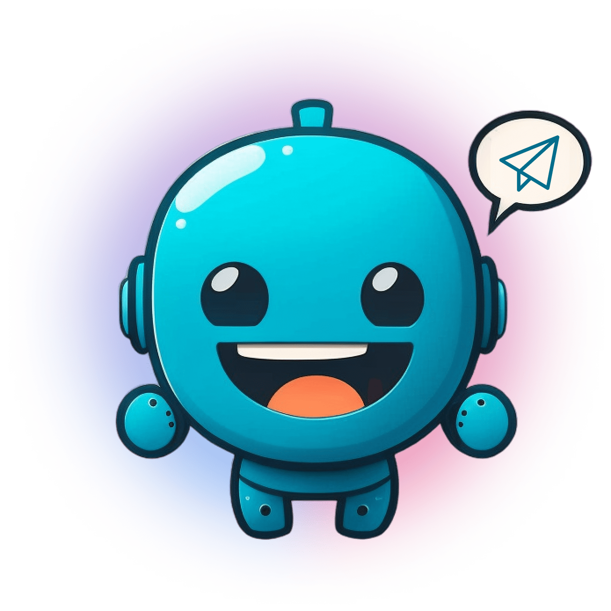

# MODULO 02: CONVERSAÇÃO LIVRE

 <br>

## DESCRIÇÃO:
- Neste `MODULO 02`, você terá a oportunidade de explorar os seguintes tópicos:

    - **Interação (Conversador/Entrevistador):**
        - Aqui, você descobrirá como programar seu bot para interagir como um verdadeiro conversador. Isso inclui entender e processar mensagens recebidas dos usuários, fornecer respostas relevantes e engajar os usuários em conversas dinâmicas e significativas.

    - **Cálculos Matemáticos:**
        - Este tópico abordará como realizar uma variedade de cálculos matemáticos utilizando Python. Você aprenderá sobre operadores matemáticos, funções integradas e bibliotecas especializadas para realizar operações matemáticas básicas.

    - **Interação (Mensageiro/Secretário):**
        - Este tópico se concentra em como seu bot pode atuar como um mensageiro ou secretário eficiente. Você aprenderá a gerenciar mensagens recebidas e enviar notificações, tornando seu bot uma ferramenta valiosa para comunicação e organização.

## PROPOSITO:
O que eles têm em comum é capacitar os alunos a desenvolver bots mais avançados, que possam realizar cálculos matemáticos, interagir de forma natural com os usuários e desempenhar funções administrativas, ampliando assim as capacidades e a utilidade dos bots no Telegram.

## CARACTERISTICAS:
### GERAL:
A característica de um bot receber qualquer mensagem do usuário, sem a necessidade de comandos predefinidos, é comumente chamada de "modo de conversação livre" ou "modo de conversação aberta". Isso significa que o bot está programado para interpretar e responder a uma ampla gama de mensagens dos usuários, sem depender de comandos específicos para interação.

Esse modo de conversação permite uma interação mais natural e flexível entre o usuário e o bot, sem a necessidade de os usuários lembrarem de comandos específicos para cada ação. Em vez disso, o bot pode utilizar técnicas de processamento de linguagem natural (PLN) para compreender a intenção por trás das mensagens dos usuários e responder de forma apropriada.

Essa abordagem é particularmente útil em casos em que os usuários podem ter diferentes necessidades ou perguntas, e o bot precisa ser capaz de lidar com uma variedade de consultas de maneira eficaz. Também é comum em bots de assistência, suporte ao cliente e outros cenários onde a interação livre é preferível para melhor atender às necessidades dos usuários.

### LAMBDA:
O AWS Lambda pode ser uma ferramenta útil para implementar essa funcionalidade de processamento de linguagem natural (PLN) em bots. O AWS Lambda é um serviço de computação em nuvem que permite executar código sem a necessidade de provisionar ou gerenciar servidores.

No contexto de um bot, você pode usar o AWS Lambda para hospedar e executar o código responsável por processar as mensagens dos usuários, aplicar técnicas de PLN para entender a intenção por trás das mensagens e gerar respostas apropriadas. Por exemplo, você pode implementar algoritmos de processamento de linguagem natural para realizar análise de sentimento, extração de entidades, classificação de intenções e muito mais.

Além disso, o AWS Lambda é altamente escalável e flexível, o que significa que você pode facilmente lidar com picos de tráfego e ajustar a capacidade conforme necessário, garantindo uma resposta rápida e confiável do bot.

### PRINCIPAL DIFERENÇA ENTRE BOTS DO MÓDULO 01 E MÓDULO 02:
Vou fornecer um exemplo de um bot simples que interage com o usuário via comandos, e depois mostrarei como o mesmo bot poderia ser implementado usando o AWS Lambda para processar esses comandos.

#### VIA COMANDOS (MÓDULO 01):
Suponha que temos um bot chamado "MeuBot" que oferece funcionalidades básicas como consulta de informações meteorológicas. Aqui está como ele poderia ser implementado sem usar o AWS Lambda:

```python
import telebot

# Inicializar o bot com o token fornecido pelo BotFather
bot = telebot.TeleBot("TOKEN_DO_SEU_BOT")

# Comando para obter informações meteorológicas
@bot.message_handler(commands=['clima'])
def clima(message):
    # Aqui você poderia chamar uma API de previsão do tempo
    # e enviar a resposta ao usuário
    bot.reply_to(message, "A previsão do tempo para hoje é ensolarada.")

# Iniciar o bot
bot.polling()
```

Neste exemplo, quando um usuário envia o comando "/clima", o bot responde com uma mensagem contendo a previsão do tempo. No entanto, esta implementação não utiliza o AWS Lambda.

#### VIA LAMBDA (MÓDULO 02):
Agora, vamos modificar o exemplo anterior para usar o AWS Lambda para processar os comandos:

1. Você precisaria criar uma função AWS Lambda que contém o código para processar os comandos do bot.
2. Esta função seria invocada sempre que uma mensagem é recebida pelo bot.
3. A função AWS Lambda seria responsável por interpretar a mensagem, identificar o comando e responder adequadamente.

Aqui está um exemplo simplificado de como essa função Lambda poderia ser implementada:

```python
import telebot

def lambda_handler(event, context):
    # Extrair informações da mensagem recebida
    message = event['message']
    command = message.get('text', '').split()[0].lower()

    # Inicializar o bot com o token fornecido pelo BotFather
    bot = telebot.TeleBot("TOKEN_DO_SEU_BOT")

    # Comando para obter informações meteorológicas
    if command == '/clima':
        # Aqui você poderia chamar uma API de previsão do tempo
        # e enviar a resposta ao usuário
        bot.send_message(message['chat']['id'], "A previsão do tempo para hoje é ensolarada.")
```

Neste exemplo, a função `lambda_handler` é invocada sempre que uma mensagem é recebida pelo bot. Ela processa a mensagem, identifica o comando e responde de acordo. Este código seria então implantado como uma função AWS Lambda para processar os comandos do bot.


