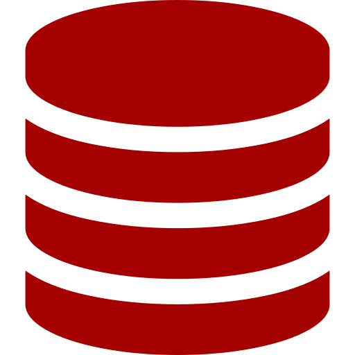

# MODULO 05: BANCO DE DADOS (DATABASE)

  

## DESCRIÇÃO:
- Neste `MODULO 05`, avançaremos para um nível mais sofisticado de desenvolvimento de bots, introduzindo o uso de Backend com bancos de dados. Aqui estão os principais tópicos que serão abordados:

1. **Banco de Dados:**
   - Você aprenderá a integrar e manipular bancos de dados em seus bots. Isso inclui ler, salvar, editar e apagar registros nos bancos de dados, seguindo as operações CRUD (Create, Read, Update, Delete). Você trabalhará com diferentes tipos de dados, como IDs, textos, nomes, números, senhas e até mídias armazenadas em diretórios do servidor.

2. **Tecnologias:**
   - No decorrer deste curso, vamos nos concentrar no uso de bancos de dados MySQL, MongoDB e JSON. Essas tecnologias são amplamente adotadas e oferecem recursos robustos para armazenamento e gerenciamento de dados. No entanto, é importante ressaltar que o mundo da tecnologia é vasto e em constante evolução. Você pode explorar outras tecnologias de banco de dados posteriormente, conforme a necessidade e o contexto dos seus projetos. A capacidade de adaptar-se e aprender novas tecnologias é uma habilidade valiosa para qualquer desenvolvedor.

## PROPOSITO:
- Neste módulo, você obterá as habilidades essenciais para integrar bancos de dados em seus bots, permitindo armazenar e gerenciar dados de forma eficiente e confiável. Isso abrirá um mundo de possibilidades para a criação de bots mais sofisticados e personalizados, capazes de lidar com uma ampla gama de aplicativos e interações com os usuários.

## DEPENDÊNCIAS:
1. **ARQUIVO.json:**
   - Este método permite realizar operações CRUD diretamente em um arquivo JSON no mesmo diretório onde o bot está sendo executado. Não é necessário instalar ou configurar nenhum banco de dados adicional. Todas as operações de criação, leitura, atualização e exclusão serão feitas no próprio arquivo JSON. Se precisar de orientações sobre como trabalhar com arquivos JSON, recomenda-se fazer o curso disponível [aqui](https://github.com/VILHALVA/CURSO-DE-JSON).

2. **MYSQL:**
   - Para usar o MySQL, você precisará configurar as informações de usuário e senha do seu banco de dados dentro do arquivo de código Python. Além disso, para economizar tempo, você pode importar o arquivo chamado `DATABASE.sql`, que contém a estrutura do banco de dados necessária. Caso não saiba como fazer isso, recomenda-se fazer o curso disponível [aqui](https://github.com/VILHALVA/CURSO-DE-MYSQL).

3. **MONGODB:**
   - Da mesma forma que com o MySQL, você precisará configurar as informações de usuário e senha do seu banco de dados MongoDB dentro do arquivo de código Python. O arquivo `DATABASE.json` pode ser encontrado no diretório, mas não é necessário importá-lo, pois é apenas uma precaução. Se precisar de orientações sobre como trabalhar com o MongoDB, recomenda-se fazer o curso disponível [aqui](https://github.com/VILHALVA/CURSO-DE-MONGODB).