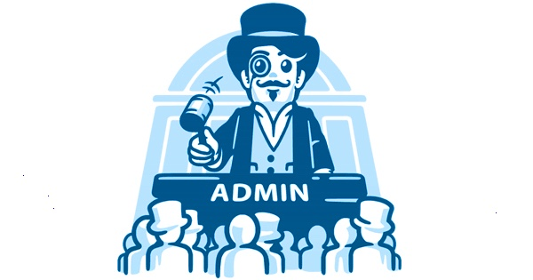

# MODULO 05: MODERADOR DE GRUPOS

  

## ATENÇÃO:
É importante ressaltar que os exemplos apresentados neste módulo são apenas versões básicas e educacionais para fins de aprendizado. Se você planeja implementar um bot em um grupo real do Telegram, é crucial entender que os bots apresentados aqui podem não ser adequados para uso imediato sem aprimoramentos significativos.

Os bots educacionais fornecidos são projetados para ilustrar conceitos fundamentais de moderação de grupo. No entanto, ao implantar um bot em um grupo real, você deve estar ciente de que várias considerações adicionais devem ser levadas em conta, incluindo escalabilidade, segurança, funcionalidades avançadas e feedback contínuo dos usuários.

Certifique-se de avaliar cuidadosamente as necessidades do seu grupo e estar preparado para fazer ajustes e melhorias significativas no bot conforme necessário. Lembre-se de que a segurança e a experiência do usuário são prioridades essenciais ao utilizar bots em grupos reais.

## DESCRIÇÃO:
- Neste `MODULO 05`, você será capacitado a desenvolver bots de moderação para grupos do Telegram. Este módulo abordará os seguintes tópicos:

1. **Comandos Básicos:**
   - Você aprenderá a implementar comandos de administração, permitindo que os bots banam, restrinjam e silenciem membros do grupo através de comandos específicos. Isso proporcionará aos administradores uma maneira eficaz de moderar o comportamento dos membros.

2. **Autonomia:**
   - Os bots terão autonomia para filtrar e administrar o grupo automaticamente, sem a necessidade de intervenção manual constante. Ao configurar funções pré-programadas no código, o bot será capaz de gerenciar o grupo de forma eficiente e autônoma, desde que seja atribuído como administrador.

3. **Banco de Dados:**
   - Você criará um bot robusto com recursos avançados de banco de dados. Os usuários poderão adicionar e configurar individualmente suas funções em cada grupo, proporcionando uma experiência de moderação altamente personalizável e adaptável às necessidades específicas de cada comunidade.

## PROPOSITO:
- O propósito deste módulo é capacitar os alunos a criar bots de moderação sofisticados e personalizáveis, que ofereçam um ambiente seguro e organizado para os grupos do Telegram, ao mesmo tempo em que reduzem a carga de trabalho manual dos administradores.

- Este módulo fornecerá a você as habilidades necessárias para criar bots de moderação poderosos e flexíveis, capazes de manter a ordem e a segurança nos grupos do Telegram de forma eficaz e eficiente.
