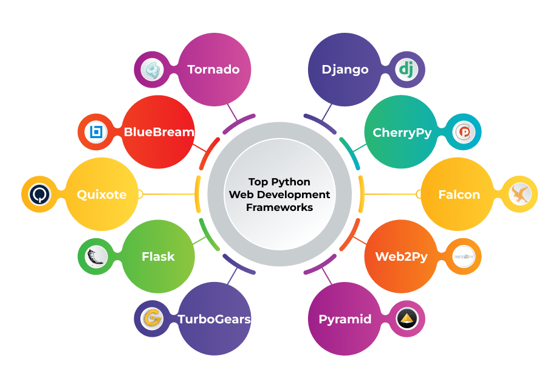

# MODULO 06: FRAMEWORKS E BIBLIOTECAS DO PYTHON

  

## DESCRIÇÃO:
Este é o **Módulo 06** do curso, onde vamos fazer uma abordagem um pouco diferente em comparação aos módulos anteriores. Aqui, vamos criar um único bot de [RECADOS](https://github.com/VILHALVA/BOT-DE-RECADOS) e convertê-lo para diferentes frameworks/Bibliotecas do Python:

- [Tkinter](https://github.com/VILHALVA/CURSO-DE-TKINTER)
- [Custom Tkinter](https://github.com/VILHALVA/CURSO-DE-CUSTOMTKINTER)
- [PyQt](https://github.com/VILHALVA/CURSO-DE-PYQT)
- [PySide](https://github.com/VILHALVA/CURSO-DE-PYSIDE)
- [wxPython](https://github.com/VILHALVA/CURSO-DE-WXPYTHON)
- [Flask](https://github.com/VILHALVA/CURSO-DE-FLASK)
- [Django](https://github.com/VILHALVA/CURSO-DE-DJANGO)
- [Pyscript](https://github.com/VILHALVA/CURSO-DE-PYSCRIPT)
- [Kivy](https://github.com/VILHALVA/CURSO-DE-KIVY)
- [BeeWare](https://github.com/VILHALVA/CURSO-DE-BEEWARE)

Estes bots oferecem uma interface gráfica simples e intuitiva para os usuários enviarem mensagens ou mídias para grupos ou canais no Telegram de forma rápida e eficiente.

## O QUE É FRAMEWORK E BIBLIOTECA? E QUAL É DIFERENÇA?
"Framework" e "biblioteca" são termos comuns na programação de software e muitas vezes são confundidos, mas têm significados distintos.

1. **Biblioteca**:
   - Uma biblioteca é um conjunto de funções ou rotinas reutilizáveis que podem ser utilizadas para realizar tarefas específicas dentro de um programa.
   - As bibliotecas geralmente consistem em código compilado ou scripts que fornecem funcionalidades específicas, como operações de manipulação de arquivos, operações matemáticas, comunicação de rede, entre outras.
   - Os desenvolvedores podem importar e utilizar as funções de uma biblioteca em seus próprios programas, o que ajuda a economizar tempo e esforço, pois não precisam reinventar a roda sempre que precisam de uma determinada funcionalidade.

2. **Framework**:
   - Um framework é uma estrutura abstrata que fornece uma base ou arcabouço para o desenvolvimento de software.
   - Os frameworks definem uma estrutura ou conjunto de padrões que orientam o desenvolvimento de aplicativos, fornecendo uma abordagem predefinida para resolver problemas comuns.
   - Diferentemente das bibliotecas, que são usadas para realizar tarefas específicas, os frameworks oferecem uma estrutura mais ampla para o desenvolvimento de aplicativos, incluindo regras, diretrizes e convenções para o fluxo de trabalho do desenvolvedor.
   - Os frameworks geralmente fornecem um conjunto de ferramentas, classes, módulos e padrões de design que os desenvolvedores podem usar para construir aplicativos de forma consistente e eficiente.

**Diferença**:
A principal diferença entre um framework e uma biblioteca está no controle do fluxo de execução. Enquanto em uma biblioteca o controle é invertido, ou seja, é o desenvolvedor quem chama as funções da biblioteca para realizar tarefas específicas, em um framework o controle é assumido pelo próprio framework. No desenvolvimento com um framework, o desenvolvedor fornece o código específico para personalizar ou estender o comportamento definido pelo framework.

## AGORA É A SUA VEZ!
Este projeto não terá um projeto final definido. Em vez disso, você terá a oportunidade emocionante de adaptar um bot de Telegram inicial para diferentes frameworks e bibliotecas. Isso significa que você receberá um código inicial e terá o desafio de fazer os ajustes necessários para torná-lo funcional em diferentes ambientes de desenvolvimento. É a sua vez de se tornar um desenvolvedor e explorar diferentes abordagens para construir e integrar um bot de Telegram.

## OBJETIVO:
O objetivo deste projeto é fornecer uma oportunidade de aprender e praticar a adaptação de código entre diferentes frameworks e bibliotecas. Ao trabalhar neste projeto, você terá a chance de:

- Aprender sobre diferentes frameworks e bibliotecas para desenvolvimento de bots de Telegram.
- Ganhar experiência prática em adaptar código para diferentes ambientes de desenvolvimento.
- Desenvolver habilidades de resolução de problemas e pensamento crítico ao lidar com desafios de integração.

## COMO TERMINAR?
Você receberá um código inicial que implementa um bot de Telegram usando uma estrutura ou biblioteca específica. Sua tarefa será fazer os ajustes necessários para torná-lo compatível com outra estrutura ou biblioteca de sua escolha. Você pode ser solicitado a ajustar rotas, implementar manipuladores de eventos, lidar com a autenticação ou realizar outras modificações conforme necessário para garantir que o bot funcione corretamente no novo ambiente.