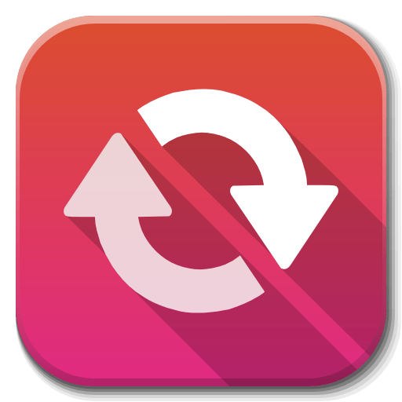

# MODULO 08: CONVERSOR DE MÍDIAS 

  

## DESCRIÇÃO:
No `Módulo 08`, daremos um upgrade no que aprendemos no `Módulo 03 - Multimídias`, expandindo nosso conhecimento sobre:

- **Tipos de Mídias:**
  - Aprenderemos a transformar nosso bot em um aplicativo interativo, capacitando-o a converter mídias como: `Áudio`, `Vídeo`, `Foto`, `Documentos` e `Textos`.

- **Projeto Final:**
  - Integraremos todos os conceitos em um único bot, onde o usuário poderá enviar a mídia e escolher o formato desejado pressionando o botão inline.

## AGORA É A SUA VEZ!
Você terá a oportunidade emocionante de adaptar cada bot conforme as necessidades específicas de configuração. Isso significa que você receberá um código inicial e terá o desafio de fazer os ajustes necessários para torná-lo funcional em diferentes ambientes de desenvolvimento. Chegou a sua vez de se tornar um desenvolvedor e explorar diferentes abordagens para construir e integrar um bot do Telegram.

## PROPÓSITO:
O propósito principal deste módulo é explorar e implementar funcionalidades de conversão de mídias. 

## COMO TERMINAR?
Você receberá um código inicial que implementa um bot do Telegram usando uma estrutura de requerimento de uma biblioteca específica. Sua tarefa será fazer os ajustes necessários para torná-lo compatível com outra estrutura ou biblioteca de sua escolha. Você poderá ser solicitado a ajustar credenciais, implementar metadados, lidar com autenticação ou realizar outras modificações conforme necessário para garantir que o bot funcione corretamente no novo ambiente.