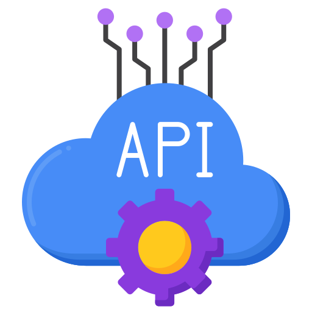

# MODULO 08: APIS EXTERNAS

  

## DESCRIÇÃO:
- Neste `MODULO 08`, exploraremos a integração do seu bot com APIs Externas:

1. **Introdução às APIs Externas**:
   - Explicação sobre o que são APIs externas e por que elas são úteis para bots do Telegram.
   - Visão geral dos diferentes tipos de APIs externas disponíveis, como APIs RESTful, APIs de consulta de banco de dados, APIs de serviços da web, etc.

2. **Integração com Serviços Web**:
   - Exploração de casos de uso comuns de integração com serviços da web, como previsão do tempo, conversão de moeda, busca de informações, etc.

## O QUE É API?
**API (Interface de Programação de Aplicações):** Uma API é um conjunto de regras, protocolos e ferramentas que permite a comunicação entre diferentes softwares. Ela define as maneiras pelas quais os componentes de software podem interagir uns com os outros. As APIs podem ser usadas para acessar funcionalidades ou dados de uma aplicação ou serviço de terceiros, permitindo a integração entre sistemas diferentes. Por exemplo, as APIs do Twitter permitem que os desenvolvedores acessem e interajam com os dados do Twitter em suas próprias aplicações.

## AGORA É A SUA VEZ!
Este Modulo não terá um projeto final definido. Em vez disso, você terá a oportunidade emocionante de adaptar cada bot para configuração de cada API. Isso significa que você receberá um código inicial e terá o desafio de fazer os ajustes necessários para torná-lo funcional em diferentes ambientes de desenvolvimento. É a sua vez de se tornar um desenvolvedor e explorar diferentes abordagens para construir e integrar um bot de Telegram.

## OBJETIVO:
O objetivo deste Modulo é fornecer uma oportunidade de aprender e praticar a adaptação de código entre diferentes APIS. Ao trabalhar neste projeto, você terá a chance de:

- Aprender sobre diferentes APIS para desenvolvimento de bots de Telegram.
- Ganhar experiência prática em adaptar código para diferentes ambientes de desenvolvimento.
- Desenvolver habilidades de resolução de problemas e pensamento crítico ao lidar com desafios de integração.

## COMO TERMINAR?
Você receberá um código inicial que implementa um bot de Telegram usando uma estrutura de API específica. Sua tarefa será fazer os ajustes necessários para torná-lo compatível com outra estrutura ou biblioteca de sua escolha. Você pode ser solicitado a ajustar crendenciais, implementar metadados, lidar com a autenticação ou realizar outras modificações conforme necessário para garantir que o bot funcione corretamente no novo ambiente.

