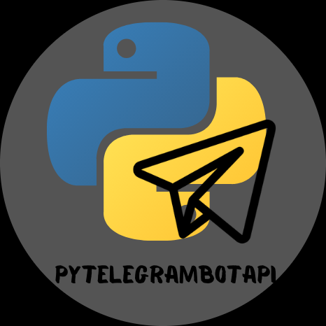

# CURSO DE TELEBOT
👨‍⚖️TELEBOT É UM FRAMEWORK DE DESENVOLVIMENTO DE BOTS PARA O APLICATIVO DE MENSAGENS TELEGRAM. ELE FORNECE UMA INTERFACE FÁCIL DE USAR PARA CRIAR E GERENCIAR BOTS, PERMITINDO QUE OS DESENVOLVEDORES CRIEM BOTS PERSONALIZADOS COM RECURSOS COMO RESPONDER A MENSAGENS, ENVIAR MENSAGENS, RECEBER ATUALIZAÇÕES DO TELEGRAM E MUITO MAIS. É UMA FERRAMENTA POPULAR ENTRE OS DESENVOLVEDORES PARA CRIAR BOTS NO TELEGRAM.

  

## CONCEITO:
Telebot é um termo que pode se referir a um bot (robô) desenvolvido para operar na plataforma de mensagens Telegram. Os bots Telegram são aplicativos de software que interagem com os usuários por meio de mensagens, fornecendo informações, realizando ações ou respondendo a comandos.

Os telebots podem ser programados para uma variedade de finalidades, desde fornecer informações sobre o clima, notícias ou horários de transporte público até automatizar tarefas como agendar reuniões, responder a consultas de clientes ou até mesmo jogar jogos.

A API do Telegram permite aos desenvolvedores criar telebots usando uma variedade de linguagens de programação, como Python, Node.js, Java, entre outras. Esses bots podem ser hospedados em servidores próprios ou em plataformas de nuvem, e interagem com os usuários por meio de mensagens de texto, botões interativos, comandos de chat e outros recursos oferecidos pela API do Telegram.

Os telebots têm se tornado cada vez mais populares devido à sua versatilidade e facilidade de uso. Eles podem ser integrados a grupos, canais e conversas individuais no Telegram, proporcionando uma maneira conveniente de automatizar tarefas e fornecer serviços aos usuários diretamente dentro da plataforma de mensagens.

## SUA HISTÓRIA:
O Telegram foi fundado pelos irmãos Pavel e Nikolai Durov e lançado em agosto de 2013. Desde o início, o Telegram se destacou por sua ênfase na privacidade, segurança e recursos avançados de comunicação. Uma das características distintivas do Telegram é seu suporte robusto para bots.

Os bots Telegram foram introduzidos pela primeira vez em junho de 2015, quando a plataforma lançou sua API de bot. Essa API permite que desenvolvedores criem bots personalizados para realizar uma variedade de tarefas, desde fornecer informações úteis até jogar jogos e interagir com os usuários de diversas maneiras.

Os telebots rapidamente se tornaram populares devido à flexibilidade e ao poder oferecidos pela API do Telegram. Eles podem ser usados para uma ampla variedade de finalidades, como fornecer atualizações automáticas, responder a comandos específicos, realizar pesquisas e muito mais.

Ao longo dos anos, a plataforma Telegram continuou a aprimorar sua API de bot e a introduzir novos recursos e funcionalidades. Isso ajudou a alimentar a crescente comunidade de desenvolvedores de telebots, que criam e compartilham uma variedade de bots úteis e divertidos para os usuários do Telegram em todo o mundo.

## CARACTERISTICAS:
### POSITIVAS:
1. **Facilidade de Uso:** Os telebots podem ser facilmente acessados e utilizados dentro do aplicativo Telegram, proporcionando uma experiência conveniente para os usuários.

2. **Automatização de Tarefas:** Os telebots podem automatizar uma variedade de tarefas, desde fornecer informações úteis até realizar ações específicas com base nos comandos dos usuários, economizando tempo e esforço.

3. **Integração com Serviços Externos:** Os telebots podem ser integrados a serviços externos, permitindo que os usuários realizem uma variedade de ações diretamente no Telegram, como solicitar informações de previsão do tempo, verificar o status de um voo ou até mesmo fazer compras online.

4. **Ampla Gama de Funcionalidades:** A API do Telegram oferece suporte a uma ampla variedade de funcionalidades para telebots, incluindo envio de mensagens, interações com botões, teclado personalizado e muito mais, permitindo aos desenvolvedores criar bots complexos e úteis.

5. **Segurança e Privacidade:** O Telegram é conhecido por seu foco em segurança e privacidade, o que proporciona aos usuários uma experiência segura ao interagir com telebots.

### NEGATIVAS:
1. **Potencial para Spam e Abuso:** Como os telebots podem ser facilmente acessados e utilizados por qualquer pessoa, existe o potencial para o envio de spam ou abuso por meio de telebots maliciosos.

2. **Limitações de Funcionalidades:** Embora a API do Telegram ofereça suporte a uma ampla variedade de funcionalidades, ainda existem algumas limitações em comparação com outras plataformas de bots, o que pode restringir a capacidade de desenvolvedores de criar bots altamente complexos.

3. **Dependência de Conectividade com a Internet:** Os telebots dependem da conectividade com a internet para funcionar corretamente, o que pode ser uma limitação em áreas com conexões instáveis ou lentas.

4. **Desenvolvimento e Manutenção Contínua:** Desenvolver e manter telebots pode exigir tempo e recursos significativos, especialmente para bots mais complexos que requerem atualizações regulares e suporte contínuo.

5. **Experiência do Usuário:** Nem todos os usuários estão familiarizados com o uso de telebots e podem ter dificuldades em interagir com eles, o que pode afetar a experiência do usuário e a adoção dos telebots.

## SUBSIDIOS:
- [CURSO CRIADO PELO "FRIKIDELTO"](https://www.youtube.com/playlist?list=PLheIVUbpfWZ2wDRHulCcuIVF-9lkIvyBi)
- [CURSO FEITO PELO VILHALVA](https://github.com/VILHALVA)
- [VEJA A DOCUMENTAÇÃO DA API](https://core.telegram.org/bots/api)
- [VEJA A DOCUMENTAÇÃO DO TELEBOT](https://pytba.readthedocs.io/en/latest/)
- [LINGUAGEM DE PROGRAMAÇÃO](https://github.com/VILHALVA/CURSO-DE-PYTHON)
- [VEJA O MANUAL](./MANUAL.md)
- [VEJA A SINTAXE](./SINTAXE.md)
- [VEJA OS PROJETOS](https://github.com/VILHALVA?tab=repositories&q=+topic:TELEBOT)

